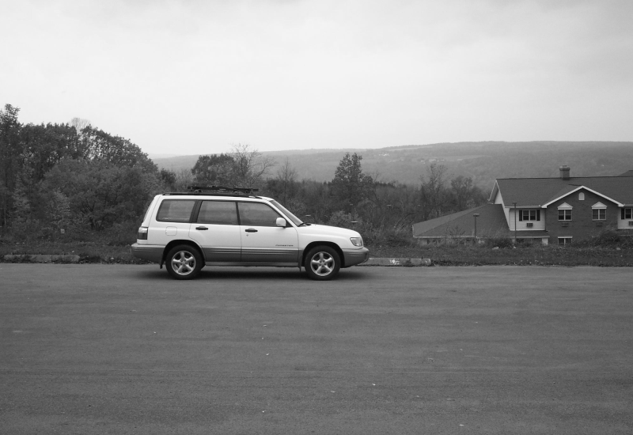
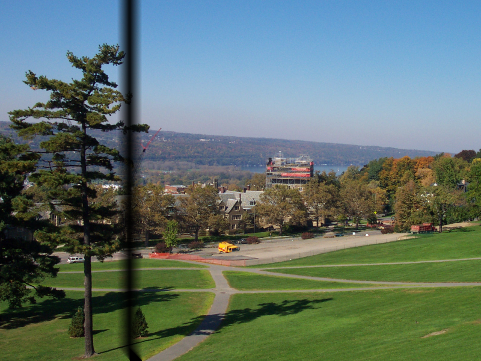
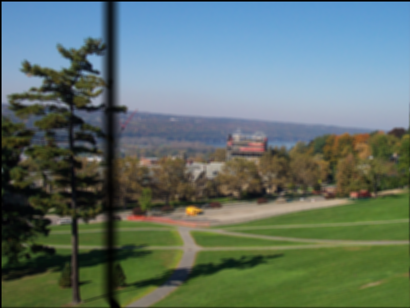
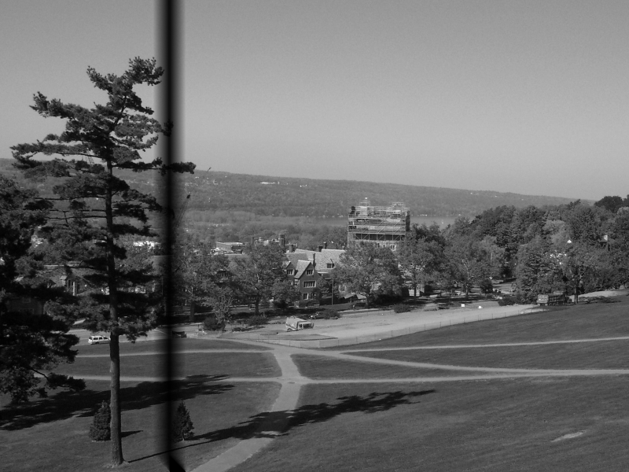

# PPM Images Processor
A simple C++ ppm processing pipeline that applies blur and greyscale filters to input images.

## PPM Files
PPM is a simple image file format used to store color images, it represents pizel data in plain text or binary.
A PPM file typically starts with a header:
- A magic number: P3 (ASCII) or P6 (binary)
- The image width and height
- The maximum color value
After the header the pixel values are stored as binary RGB triplets.

For more details: [PPM Image Format](https://www.cs.swarthmore.edu/~soni/cs35/f13/Labs/extras/01/ppm_info.html)

## Building
```bash
git clone https://github.com/your-username/ImageProcessor.git
cd ImageProcessor
mkdir build && cd build
cmake ..
make
```

## Sample output
Below is a 3x3 grid of sample images. In each row 
the left image is the original, the center image is the blurred version 
and the right image is the greyscale version.

| Original | Blurred | Greyscale |
| -------- | ------- | --------- |
|  |  |  |
|  |  |  |
|  |  |  |
