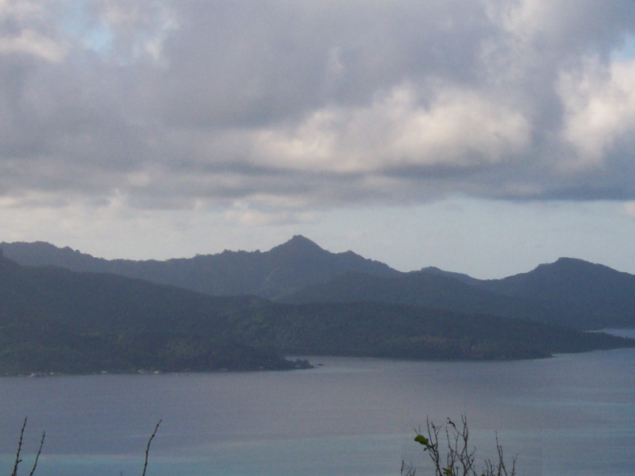
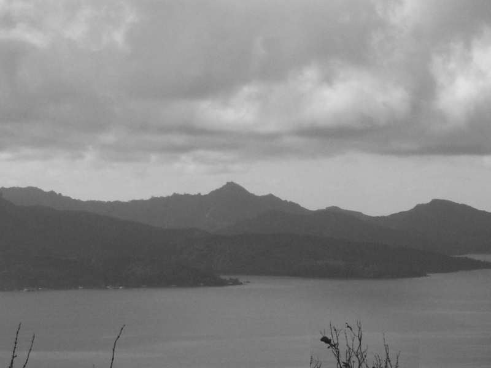

# PPM Images Processor
A simple C++ ppm processing pipeline that applies blur and greyscale filters to input images.

## Building
```bash
git clone https://github.com/your-username/ImageProcessor.git
cd ImageProcessor
mkdir build && cd build
cmake ..
make
```

## Sample output
Below is a 3x3 grid of sample images. In each row 
the left image is the original, the center image is the blurred version 
and the right image is the greyscale version.

| Original | Blurred | Greyscale |
| -------- | ------- | --------- |
|  |  |  |
|  |  |  |
|  |  |  |
